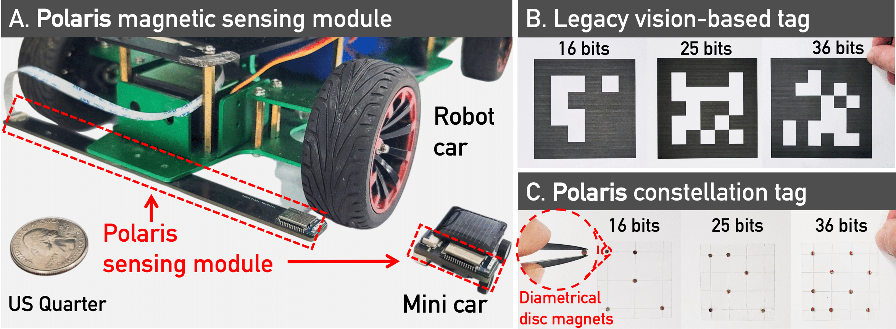

# The source code of the artifact submission for Polaris in MobiCom'24

This repository contains the artifacts and guidelines for ACM Badging in the MobiCom 2024 proceedings.

# Overview
We present Polaris, the first vision-free fiducial marking system, based on a novel, full-stack magnetic sensing design. 
Polaris can achieve reliable and accurate pose estimation and contextual perception, even in NLOS scenarios. 

Its core design includes: (1) a novel digital modulation scheme, Magnetic Orientation-shift Keying (MOSK) that can encode key information like waypoints and coordinates with passive magnets; (2) a robust and lightweight magnetic sensing framework to decode and localize the magnetic tags. 
Our design also equips Polaris with three key features: sufficient encoding capacity, robust detection accuracy, and low energy consumption. 
We have built an end-to-end system of Polaris and tested it extensively in real-world scenarios. The testing results have shown Polaris to achieve an accuracy of up to 0.58 mm and 1&deg; in posture estimation with a power consumption of only 25.08 mW.

# Setup
To use Polaris, the following steps are required:

## Hardware implementation
We provide the hardware requirements and manufacturing details of Polaris' sensing array in `/PCBs`, please see the related [README](./PCBs/README.md) file.

## Programing the sensor array
Based on the hardware, we use Arduino IDE for programing the sensor array.
### Arduino IDE setup

### Programing the sensor array

## Sensing pipeline

# Run a quick demo
You can find a quick demo in the `/Quick_Demo` directory. For more information, please refer to the related [README](./Quick_Demo/README.md) file.